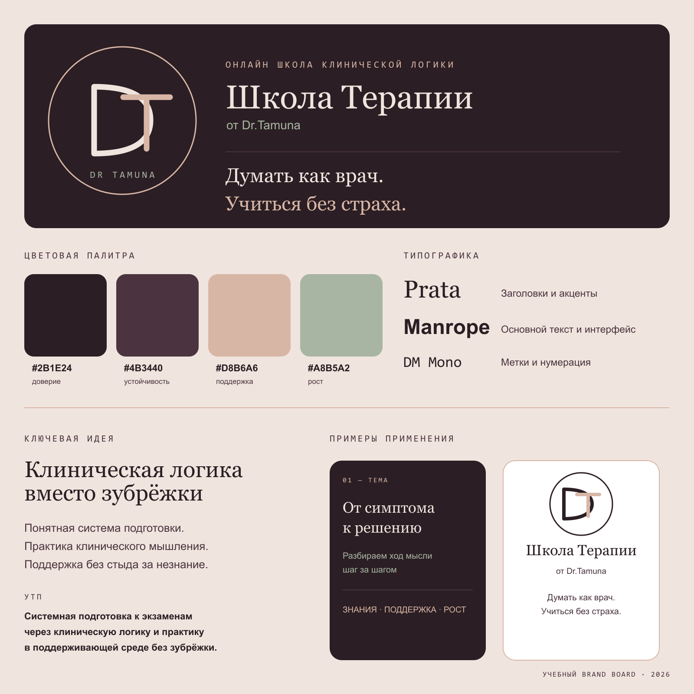

# Стартап в информационных технологиях

**Практическое занятие №1:** Товарный знак и брендирование

**Стартап:** «Школа Терапии»

## Название и слоган

**Публичное название:** «Школа Терапии»

**Полная версия:** «Школа Терапии от Dr.Tamuna»

**Слоган:** «Думать как врач. Учиться без страха».

## Уникальное торговое предложение

Для студентов-медиков, ординаторов и молодых врачей мы создаём онлайн-школу, которая помогает системно готовиться к государственным экзаменам и аккредитации и развивать клиническое мышление. В отличие от самостоятельной подготовки по разрозненным источникам и заучивания готовых ответов, школа объясняет ход клинического рассуждения шаг за шагом, опирается на опыт практикующих врачей и создаёт безопасную среду для вопросов и разбора ошибок.

## Позиционирование

- клиническая логика вместо зубрёжки;
- практическая подготовка к экзаменам, аккредитации и клиническим задачам;
- профессиональная и поддерживающая атмосфера, где не стыдно не знать;
- онлайн-формат, совместимый с учёбой и дежурствами.

## Визуальная айдентика

**Характер:** академичный, спокойный, экспертный и доброжелательный.

**Основные цвета:**

- глубокий сливовый — `#2B1E24`;
- сливовый — `#4B3440`;
- тёплый розово-бежевый — `#D8B6A6`;
- мягкий тёплый белый — `#F0E5DE`;
- приглушённый зелёный — `#A8B5A2`.

**Шрифтовая пара:** Prata для заголовков и Manrope для основного текста. DM Mono используется для коротких подписей и нумерации.

## Brand board

Монограмма `D / T` на доске — учебный эскиз для презентации концепции. Регистрация названия или логотипа в качестве товарного знака в рамках этой работы не подтверждается.
